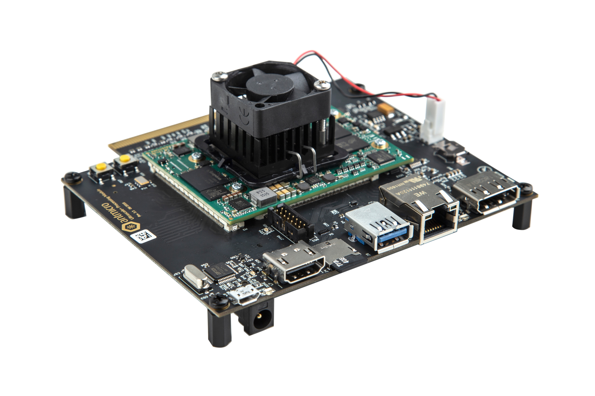
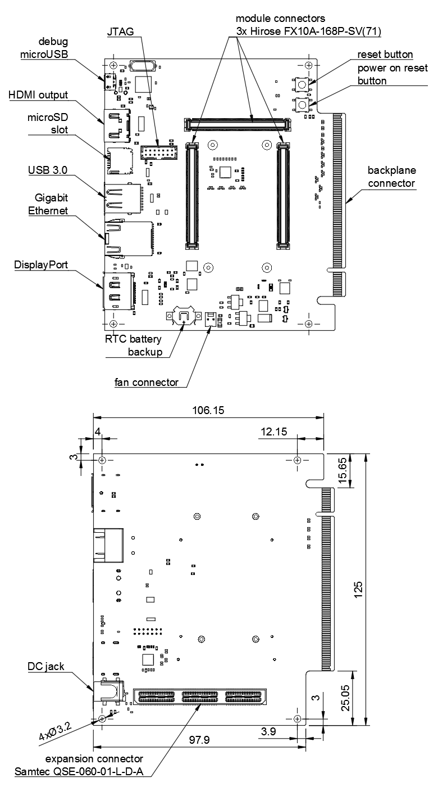

Antmicro UltraScale+ Processing Module
======================================

Copyright (c) 2016-2021 `Antmicro <https://www.antmicro.com/>`_

Overview
========

Antmicro’s Ultrascale+ Processing Module is a specialized development board supporting Enclustra `Mercury+ XU1 module <https://www.enclustra.com/en/products/system-on-chip-modules/mercury-xu1/>`_ with an embedded Xilinx Zynq UltraScale+ FPGA MPSoC, created for high-speed data processing applications.
The UltraScale+ Processing Module is an excellent starting point for developing your next generation FPGA MPSoC product in machine vision, image acquisition & processing, industrial motion control and other applications.

Repository structure:
---------------------

The main repository directory contains the Altium PCB project file, the Outjob file, LICENSE and README.
The remaining files are stored in the following directories:

* ``PCB`` -  contains all Altium design files
* ``Libraries`` - contains the component libraries
* ``Documentation`` - contains selected files for device fabrication (schematic in PDF, BoM) generated from the Altium project
* ``Images`` - contains graphics for this README
* ``3DModels`` - contains files defining the mechanical model of the assembled board

The PCB project files were prepared in Altium Designer 14.1.

Key Features
============

* Enclustra Mercury+ module connector
* 28 differential pairs available on the edge backplane connector
* 48 differential pairs available on the board-to-board Samtec QSE expansion connector
* DisplayPort as the default video output from the system
* FPGA-driven HDMI output display interface
* MicroSD card slot
* USB 3.0 host interface
* Gigabit Ethernet
* DisplayPort output video interface
* 14-pin JTAG interface

Please note that the backplane connector available on board is not pin-compatible with PCIe x16 standard.

Board layout & dimensions
=========================

Getting started
===============

The board can be produced and assembled using the provided design files.
Please take a look at the mechanical layers for more information regarding the PCB stackup recommended for fabrication.
The board should be powered by a 12V DC power supply. 
It is recommended to use the USB debug console interface of the UltraScale+ Processing Module for the first boot.
Use a micro-USB cable to connect the board to your PC.
The board has a built-in dual channel USB/UART converter which is USB bus powered.
Two new serial devices should appear in your system.
One of them, designated with the lower number (/dev/ttyUSB0) is used as a debug console whereas the other (/dev/ttyUSB1) is a general purpose UART connected to the FPGA fabric.
Use your favourite terminal client (e.g. minicom) to open the debug console interface port. The default connection baudrate is 115200 with 8-bit transmission, 1 stop bit and no flow control.

License
=======

`Apache-2.0 <LICENSE>`_
